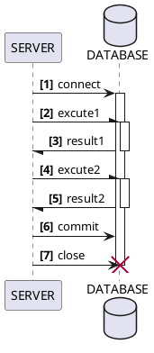

# SQLite

SQL로 데이터 베이스를 관리할 수 있는 여러가지 방법 중에서 간단한 SQLite를 배워볼 것 입니다.

## DataBase의 작업 루틴
데이터 베이스는 아래와 같은 작업 루틴을 가집니다.

{style="medium"}
connect
: 데이터 베이스를 엽니다.

execute
: SQL의 문법을 사용해서 데이터 베이스에 명령을 실행합니다.

commit
: 변경된 사항을 저장합니다.

close
: 데이터 베이스를 닫습니다.

> 저장이 되지 않으니, 조심해주세요.

{style="warning"}{title="commit을 하지 않고 닫으면,"}

## Data Type
일단 각 칼럼에 들어갈 수 있는 데이터 타입을 알아봅시다.

{style="medium"}
NULL
: 파이썬의 `None`과 같이 아무것도 없는 값을 말합니다.

INTEGER
: 정수, 0~8비트 정도의 수를 저장할 수 있습니다.

REAL
: 파이썬의 `float`와 같은 실수입니다.

TEXT
: 크기를 알 수 없는 다량의 문자열을 저장할 때 사용합니다,.

BLOB
: *Binary Large Object*의 약자로, 이미지와 같은 다양한 파일들을 저장할 수 있습니다.
